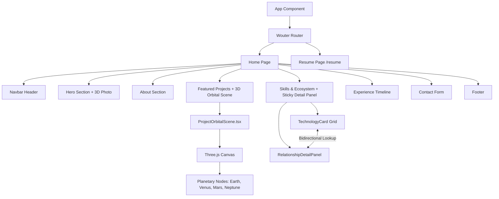

<div align="center">

  # 🪐 Taha Sohail — Software Engineer Portfolio
  
  <p align="center">
    <b>A high-performance 3D interactive portfolio & technology ecosystem built with React 18, Three.js, React Three Fiber, TypeScript, and Framer Motion.</b>
  </p>

  <p align="center">
    <a href="https://github.com/TahaSohail-Goat/my_portfolio">
      
    </a>
    <a href="https://github.com/TahaSohail-Goat/my_portfolio/network/members">
      
    </a>
    <a href="https://github.com/TahaSohail-Goat/my_portfolio/blob/main/LICENSE">
      
    </a>
  </p>

  <br />

  ```ascii
  _____ _____ _____ _____   _____ _____ _____ _____ _____ _____ _____ 
  |_   _|  _  |  |  |  _  | |  _  |     | __  |_   _|  ___|     |   __|
    | | |     |  |  |     | |   __|  |  |    -| | | |  ___|  |  |__   |
    |_| |_||_||__|__||_||_| |__|  |_____|__|__| |_| |___| |_____|_____|
  ```

  <br />

  <!-- Animated Caps & Typing Banner -->
  <a href="https://github.com/TahaSohail-Goat/my_portfolio">
    
  </a>

</div>

---

## ✨ Key Interactive Features

### 🌌 1. 3D NASA-Textured Solar System Project Scene
- **Interactive Orbiting Nodes**: Projects are represented as textured planets orbiting in a 3D Canvas built using `@react-three/fiber` and `@react-three/drei`.
- **Realistic Planetary Surfaces**: Custom texture mapping using NASA/JPL imagery for **Earth** (blue oceans & continents), **Venus** (golden atmospheric clouds), **Mars** (rusty red terrain), and **Neptune** (deep cyan gas giant).
- **Safe Fallback Architecture**: Custom `useSafeTexture` hook using standard `THREE.TextureLoader` with automatic graceful fallback to solid materials if textures fail to load.

### 🔗 2. Technology Ecosystem & Bidirectional Relationship System
- **2-Column Layout**: Left column features technology icon cards grouped into domain categories (`Languages`, `Frontend`, `Backend`, `Databases`, `AI/ML`, `CS Fundamentals`, `Tools`).
- **Bidirectional Relationship Matching**: Hovering any technology (e.g. `React`) automatically highlights all connected stack dependencies (`Next.js`, `Vite`, `TypeScript`, `Tailwind`) in both directions.
- **Sticky Ecosystem Detail Panel**: Stays dynamically pinned (`position: sticky`, `top: 96px`) as you scroll, displaying full descriptions and interactive stack dependency links.

### 🖼️ 3. 3D Interactive Parallax Photo Frame
- **Cursor Tracking & Physics**: Smooth 3D tilt and perspective matrix transforms (`rotateX`, `rotateY`, `translateZ`) reacting in real time to mouse position.
- **Ambient Neon Glow**: Multi-layered backdrop glow effect responding to theme colors (`#00f5d4`).

### 📄 4. Comprehensive Resume Suite
- **Direct PDF Integration**: Embedded CV link serving `/Resume.pdf` from the `public/` directory across Navbar, Hero, and Footer.
- **Dedicated Styled Resume Page**: Responsive HTML resume page at `/resume` matching the portfolio's dark futuristic design system, ready for web viewing and printing.

### ⚡ 5. Zero-Flash Shutter Loading Screen
- Dual-panel dark shutter opening animation powered by Framer Motion.
- Persistent DOM mounting prevents black screen flashes during transition.

---

## 🛠️ Technology Stack

| Category | Technologies & Tools |
| :--- | :--- |
| **Core & Language** | `TypeScript`, `JavaScript (ES6+)`, `HTML5`, `CSS3` |
| **Frontend Framework** | `React 18`, `Vite`, `Wouter` (Client-side routing) |
| **3D Graphics & Physics** | `Three.js`, `React Three Fiber (@react-three/fiber)`, `@react-three/drei` |
| **Animations & UI** | `Framer Motion`, `Lucide React`, `React Icons`, `Tailwind CSS` |
| **Backend & APIs** | `Node.js`, `Express`, `REST APIs`, `Python`, `C++` |
| **Databases** | `MongoDB`, `MySQL`, `PostgreSQL` |

---

## 📐 Architecture Overview



---

## 🚀 Getting Started

Follow these instructions to run the portfolio locally on your machine.

### Prerequisites

Ensure you have **Node.js** (v18.0.0 or higher) and **npm** installed:
```bash
node -v
npm -v
```

### Installation

1. **Clone the repository:**
   ```bash
   git clone https://github.com/TahaSohail-Goat/my_portfolio.git
   cd my_portfolio
   ```

2. **Install dependencies:**
   ```bash
   npm install
   ```

3. **Start the local development server:**
   ```bash
   npm run dev
   ```
   Open your browser and navigate to `http://localhost:5173/` (or `http://localhost:5174/`).

4. **Verify TypeScript compilation:**
   ```bash
   npm run typecheck
   ```

---

## 📂 Repository Structure

```
portfolio/
├── public/
│   ├── Resume.pdf               # Downloadable CV document
│   ├── taha-photo.png           # High-resolution 3D hero portrait
│   └── textures/planets/        # NASA planetary surface maps (Earth, Venus, Mars, Neptune)
├── src/
│   ├── components/
│   │   ├── 3d/                  # Three.js & R3F components (Background3D, HeroPhoto3D, OrbitalScene)
│   │   ├── layout/              # Navbar, Footer
│   │   ├── sections/            # Hero, About, Projects, Skills, Experience, Contact
│   │   └── ui/                  # LoadingScreen, Typewriter, Primitives
│   ├── data/                    # Projects and Experience data files
│   ├── pages/                   # Home.tsx, Resume.tsx, not-found.tsx
│   ├── App.tsx                  # Application root & Wouter router setup
│   └── index.css                # Global design system, glassmorphism tokens, and custom scrollbars
└── package.json
```

---

## 👤 Author

**Taha Sohail**
- **Degree**: BS Software Engineering · FAST-NUCES, Pakistan
- **GitHub**: [@TahaSohail-Goat](https://github.com/TahaSohail-Goat)
- **LinkedIn**: [Taha Sohail](https://www.linkedin.com/in/taha-sohail-7b03b8320/)
- **Email**: [tahaxsohail@gmail.com](mailto:tahaxsohail@gmail.com)

---

<div align="center">
  <p>Designed and engineered with ❤️ by Taha Sohail</p>
</div>
